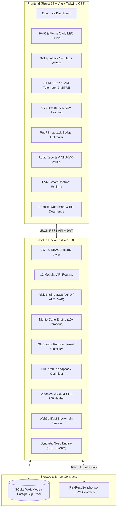

# CYBER FLOCK DEFENSE HUB
### *Detect. Quantify. Optimize. Verify.*

[]()
[]()
[]()
[]()
[]()

CYBER FLOCK DEFENSE HUB is an enterprise-grade, local-first cybersecurity SaaS web platform built for C-suite executives, CISOs, security analysts, and risk auditors. It bridges real-time security telemetry with financial cyber risk quantification, defensive synthetic attack simulation, budget optimization, and cryptographic smart contract verification.

---

## Architecture Overview



---

## Key Features

1. **Financial Risk Quantification (FAIR Model)**:
   - **SLE** (Single Loss Expectancy): $\text{Asset Value} \times \text{Exposure Factor}$.
   - **ARO** (Annual Rate of Occurrence): Poisson rate estimation based on vulnerability and telemetry history.
   - **ALE** (Annualized Loss Expectancy): $\text{SLE} \times \text{ARO}$.
   - **Value at Risk (VaR)**: Percentile confidence boundaries at 90%, 95%, and 99% (P99 Black Swan exposure).
   - **Interactive Multi-Currency**: Real-time dual display and automatic conversion between USD ($) and INR (₹).

2. **Compound Monte Carlo Engine**:
   - 10,000 synthetic trials per simulation.
   - Poisson frequency sampling combined with Lognormal severity distributions.
   - Loss Exceedance Curve (LEC) rendering with exceedance probability mapping.

3. **8-Step Defensive Attack Simulation Wizard**:
   - **Step 1**: Select Adversary / Threat Actor Profile (Nation State APT, Ransomware Cartel, Insider, Script Kiddie).
   - **Step 2**: Select Initial Access Technique (MITRE ATT&CK T1190, T1566, T1078, T1195).
   - **Step 3**: Select Target Monitored CVE (CVSS 3.1 & EPSS Likelihood).
   - **Step 4**: Toggle Defense In-Depth Controls (EDR, FIDO2 MFA, WAF, Microsegmentation, Immutable Backups).
   - **Step 5**: Synthetic Attack Execution Engine with real-time terminal log animation.
   - **Step 6**: AI/ML Breach Likelihood Evaluation (XGBoost classifier with feature gain ranking).
   - **Step 7**: Monte Carlo Scenario Financial Loss Estimation.
   - **Step 8**: Deterministic Canonical SHA-256 Cryptographic Seal & Blockchain Anchoring.

4. **Security Investment & Budget Optimization (PuLP)**:
   - 0/1 Knapsack Mixed Integer Linear Programming (MILP) solver.
   - Allocates finite cybersecurity capital expenditures to maximize net ALE reduction.
   - Calculates ROSI (Return on Security Investment) percentage and provides funded vs unfunded control justifications.

5. **Cryptographic Integrity & EVM Blockchain Anchoring**:
   - Deterministic canonical JSON key ordering (`sort_keys=True`, normalized separators).
   - SHA-256 payload integrity hashing.
   - Smart contract integration via `blockchain/contracts/RiskResultAnchor.sol`.
   - On-chain proof inspection and fallback proof verification engine.

6. **Defensive Client Deterrence**:
   - **Dynamic Canvas/SVG Forensic Watermark**: Renders active user work email, IP, and timestamp at subtle opacity to prevent unauthorized leaks.
   - **Window Focus Blur Deterrence**: Conceals sensitive dashboard telemetry and financial loss figures when window loses focus or browser tab changes.

---

## Getting Started (Localhost Execution)

### Prerequisites
- Python 3.11+
- Node.js 18+ and npm
- Windows (PowerShell / Command Prompt)

### 1. One-Click Launch
Run the provided batch script from the repository root:
```bat
scripts\start-all.bat
```
This automatically launches both backend (port 8000) and frontend (port 5173) in separate command windows.

### 2. Manual Startup

#### Backend Setup
```powershell
cd backend
python -m venv venv
.\venv\Scripts\activate
pip install -r requirements.txt
python -m app.services.fake_data_generator
python -m uvicorn app.main:app --host 127.0.0.1 --port 8000 --reload
```

#### Frontend Setup
```powershell
cd frontend
npm install
npm run dev
```

---

## Seeded Demo User Credentials

| Role | Email | Password | Access Rights |
| :--- | :--- | :--- | :--- |
| **Super Admin** | `admin@cyberflock.defense` | `AdminSecurePassword123!` | Full System, Tenant & User Admin |
| **Security Analyst** | `analyst.sarah@cyberflock.defense` | `AnalystSecurePassword123!` | Telemetry, Simulations, CVEs |
| **Executive / CISO** | `ciso.elena@cyberflock.defense` | `ExecutiveSecurePassword123!` | Board Reports, Financial Quant, Benchmarks |
| **Risk Auditor** | `auditor.marcus@cyberflock.defense` | `AuditorSecurePassword123!` | Reports & Cryptographic Verifications |

*(Fast-Login demo buttons are embedded directly into the `/login` screen for one-click testing.)*

---

## Running Automated Tests

Run the full pytest suite (18 unit and integration tests):
```powershell
.\backend\venv\Scripts\pytest.exe -v
```
Verified Test Areas:
- `test_auth.py`: Password hashing, JWT token creation, expiration, and tampering.
- `test_risk_engine.py`: SLE, ARO, ALE, VaR percentiles, loss breakdown, and INR/USD currency conversion.
- `test_monte_carlo.py`: 10,000 iterations Poisson-Lognormal distribution and exceedance curve correctness.
- `test_optimizer.py`: PuLP 0/1 Knapsack constraints and optimal ROI selection.
- `test_hasher_blockchain.py`: Canonical JSON determinism, SHA-256 verification, and EVM anchor fallback.
- `test_api_endpoints.py`: Root health, public demo booking, admin authentication, and asset listings.

---

## Disclaimer & Ethical Notice
*CYBER FLOCK DEFENSE HUB is strictly a defensive platform designed for risk quantification and architectural simulation. All adversarial scenarios, alerts, and CVE events are simulated in-process with `is_simulated = True`.*
